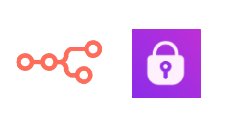
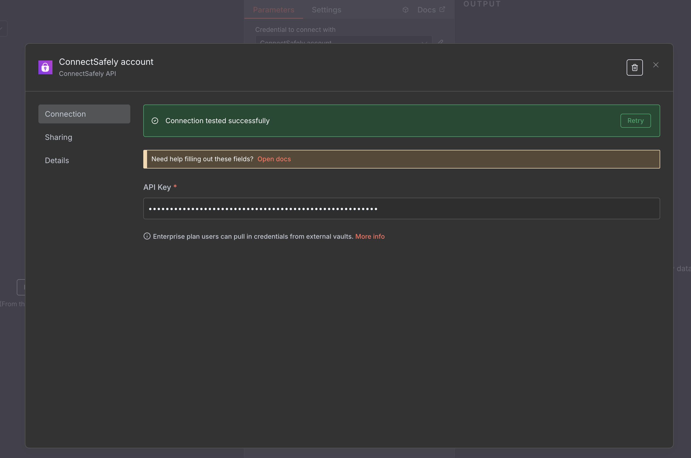

# n8n-nodes-connectsafely-ai

  

This is an n8n community node that allows you to interact with ConnectSafely.ai in your `n8n` workflows.

**ConnectSafely.ai** is a LinkedIn automation platform that provides safe and compliant tools for automating LinkedIn engagement, post management, and profile analysis. It offers powerful APIs for LinkedIn automation while maintaining account safety and compliance with LinkedIn's terms of service.

If you've been trying to automate LinkedIn tasks like `social media engagement`, `lead generation`, `profile analysis`, or `content management` with `n8n` and want to avoid dealing with LinkedIn's complex API restrictions, the `n8n-nodes-connectsafely-ai` will make your life easier.

[n8n](https://n8n.io/) is a [fair-code licensed](https://docs.n8n.io/reference/license/) workflow automation platform.

## Table of Contents

[Installation](#installation)  
[Operations](#operations)  
[Credentials](#credentials)  
[Compatibility](#compatibility)  
[Usage](#usage)  
[Resources](#resources)  
[Version history](#version-history)

## Highlights

* Full LinkedIn automation control
* Safe and compliant operations
* Profile analysis and lead generation
* Post engagement and management
* Connection request automation
* Real-time relationship tracking
* Advanced content scraping
* Custom targeting options  

## Installation

1. Sign up at [ConnectSafely.ai](https://connectsafely.ai) and get your API key
2. Visit your n8n instance > Settings > Community Nodes > Install `n8n-nodes-connectsafely-ai`
3. Set up ConnectSafely credentials with your API key
4. Add any ConnectSafely node to your workflow by searching for `connectsafely`
5. Start automating LinkedIn in your n8n workflows!

Follow the [installation guide](https://docs.n8n.io/integrations/community-nodes/installation/) in the n8n community nodes documentation.

## Operations

* Follow or unfollow LinkedIn users
* Send direct messages to LinkedIn users
* Send connection requests with custom messages
* Check relationship status with other users
* Get latest posts from LinkedIn users
* React to posts with various reaction types
* Comment on LinkedIn posts
* Retrieve comments from posts with pagination
* Search for posts by keywords with filters
* Scrape public post content without authentication
* Fetch detailed profile information
* Analyze profiles with geo location and contact data

## Credentials

This node requires a ConnectSafely.ai `API key` to connect to your ConnectSafely account.

  

## Compatibility

This node was developed on `n8n@1.0.0`. It hasn't been tested on other versions yet.

## Usage

1. Add any ConnectSafely node to your workflow.
2. Configure your node.

## Anti-Bot Detection

With strong support from ConnectSafely.ai, you can implement robust anti-bot detection using the following features:

* **Rate Limiting**: Built-in limits to prevent account restrictions
* **Natural Behavior**: Mimics human-like engagement patterns
* **Quality Control**: Filters out low-quality connections and content
* **Compliance**: Follows LinkedIn's terms of service

## Resources

* [n8n Community Nodes Documentation](https://docs.n8n.io/integrations/#community-nodes)
* [ConnectSafely.ai Homepage](https://connectsafely.ai)
* [ConnectSafely.ai API Documentation](https://connectsafely.ai/n8n-docs)
* [ConnectSafely.ai Support](mailto:support@connectsafely.ai)

## Version History

* `0.1.0` Initial release
* `0.1.0` LinkedIn Actions node with follow, message, and connection management
* `0.1.0` LinkedIn Posts node with engagement, commenting, and scraping
* `0.1.0` LinkedIn Profiles node with profile fetching and analysis
* `0.1.0` Full API integration with ConnectSafely.ai platform

## About

n8n node to interact with ConnectSafely.ai instance

### Topics

linkedin-automation  social-media-automation  connectsafely  n8n  n8n-nodes  n8n-community-node-package  lead-generation  profile-analysis

---

**Made with ❤️ by the ConnectSafely team**

[ConnectSafely.ai](https://connectsafely.ai) | [Documentation](https://connectsafely.ai/n8n-docs) | [YouTube](https://www.youtube.com/@ConnectSafelyAI-v2x) | [Support](mailto:support@connectsafely.ai)