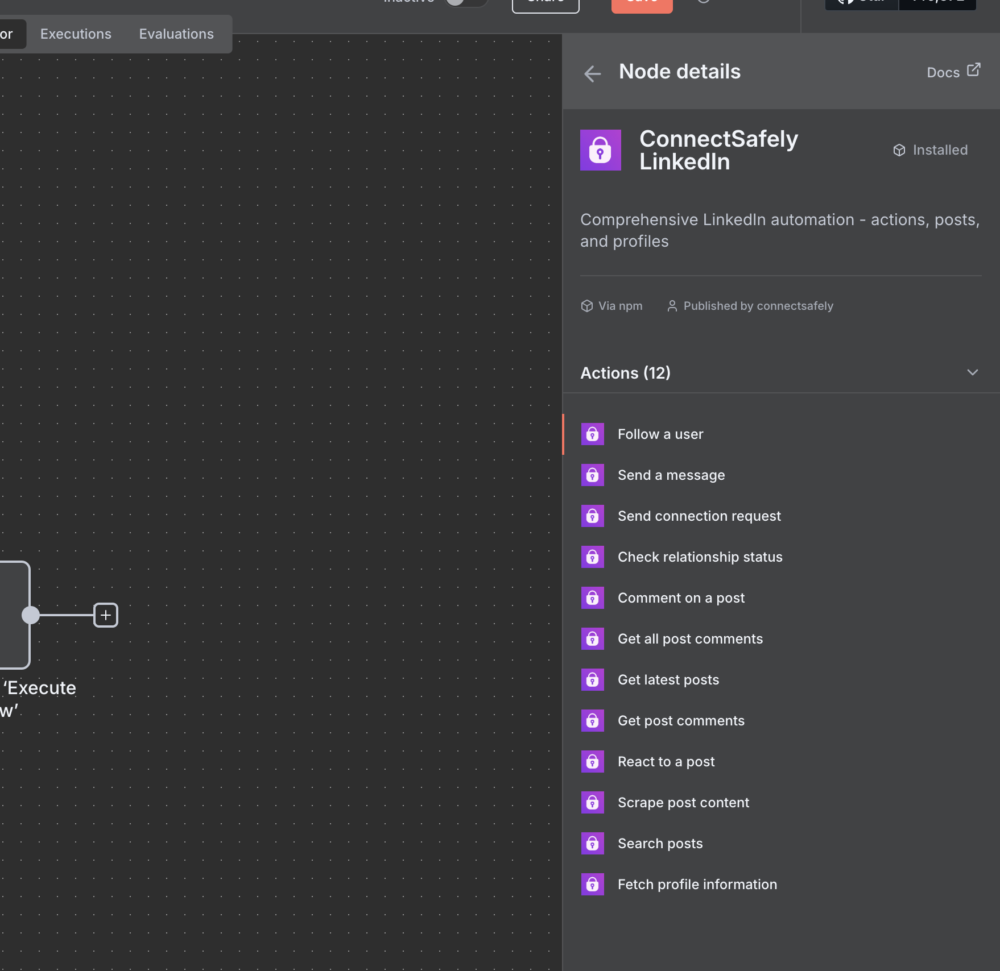
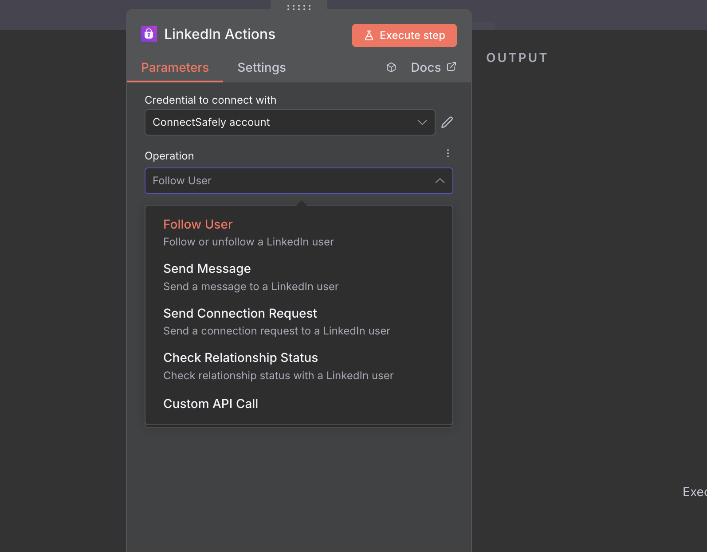
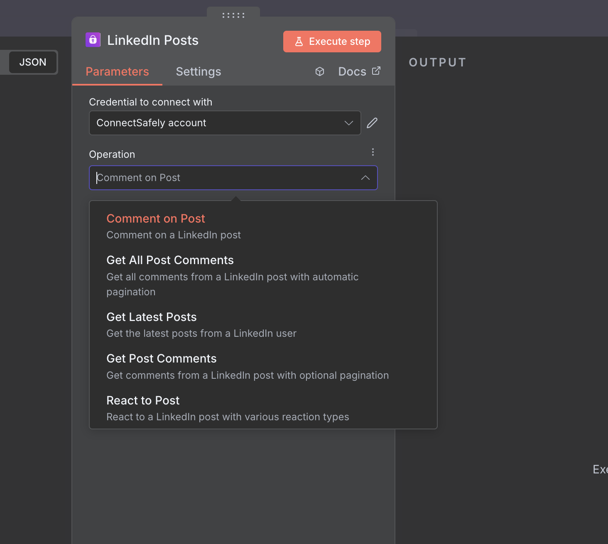
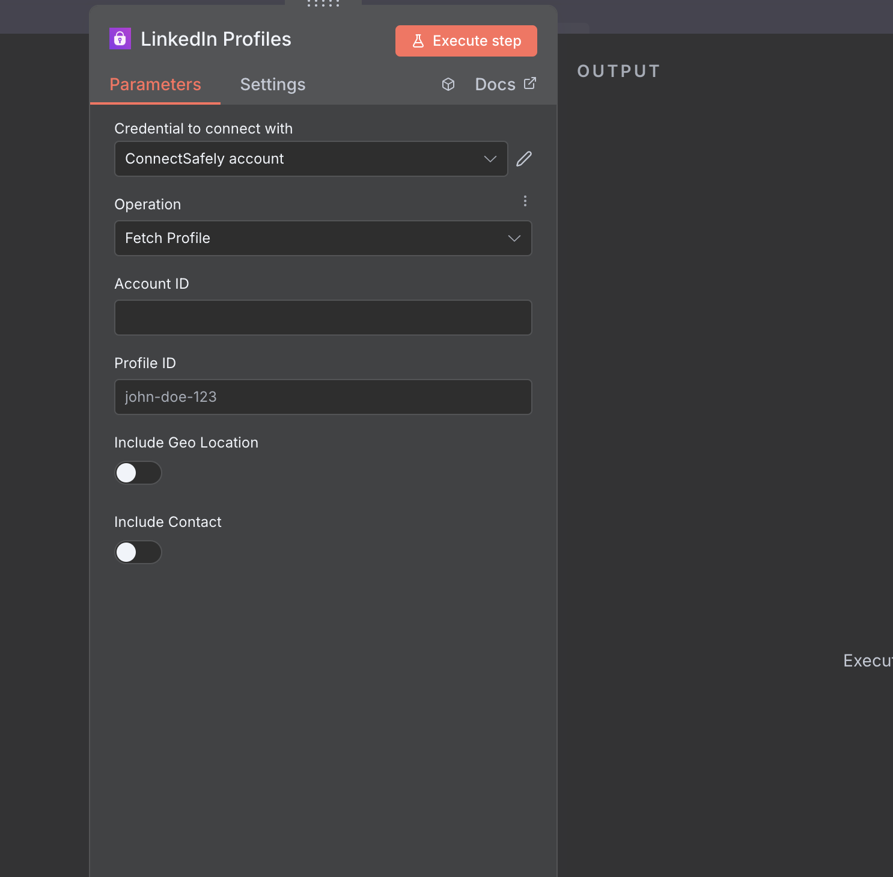

# n8n-nodes-connectsafely-ai

This is an n8n community node. It lets you use ConnectSafely.ai in your n8n workflows.

ConnectSafely.ai is a LinkedIn automation platform that provides safe and compliant tools for automating LinkedIn engagement, post management, and profile analysis.

[n8n](https://n8n.io/) is a [fair-code licensed](https://docs.n8n.io/reference/license/) workflow automation platform.



[Installation](#installation)  
[Operations](#operations)  
[Credentials](#credentials)  
[Compatibility](#compatibility)  
[Usage](#usage)  
[Resources](#resources)  
[Version history](#version-history)  

## Installation

Follow the [installation guide](https://docs.n8n.io/integrations/community-nodes/installation/) in the n8n community nodes documentation.

```bash
npm install n8n-nodes-connectsafely-ai
```

## Operations

### LinkedIn Actions Node


**Available Actions**:
- **Follow User**: Follow or unfollow LinkedIn users
- **Send Message**: Send direct messages to LinkedIn users  
- **Send Connection Request**: Send connection requests with custom messages
- **Check Relationship**: Check your relationship status with other users

### LinkedIn Posts Node


**Available Actions**:
- **Get Latest Posts**: Fetch the latest posts from LinkedIn users
- **React to Post**: React to posts with various reaction types (Like, Praise, etc.)
- **Comment on Post**: Comment on LinkedIn posts
- **Get Post Comments**: Retrieve comments from posts with pagination
- **Get All Post Comments**: Get all comments from a post (with pagination)
- **Search Posts**: Search for posts by keywords with filters
- **Scrape Post**: Scrape public post content without authentication

### LinkedIn Profiles Node


**Available Actions**:
- **Fetch Profile**: Get detailed profile information including experience, education, and contact details

**Features**:
- **Include Geo Location**: Option to include geographical location data
- **Include Contact Info**: Option to include contact information
- **Profile Analysis**: Get comprehensive profile insights

## Credentials

To use this node, you need to authenticate with ConnectSafely.ai:

1. Sign up at [ConnectSafely.ai](https://connectsafely.ai)
2. Navigate to your API settings
3. Generate an API key
4. In n8n, go to **Credentials** → **Add Credential**
5. Search for "ConnectSafely API"
6. Enter your API key
7. Test the connection

## Compatibility

- **Minimum n8n version**: 1.0.0
- **Tested with n8n versions**: 1.0.0+
- **Node.js version**: >=20.15

## Usage

### Quick Start

1. **Add a Node**: Drag any ConnectSafely node from the node panel into your workflow
2. **Configure Credentials**: Select or create your ConnectSafely API credentials
3. **Choose Operation**: Select the action you want to perform from the dropdown
4. **Set Parameters**: Configure the required parameters for your selected operation
5. **Execute**: Run your workflow to automate LinkedIn actions

### All Available Actions Summary

**LinkedIn Actions Node**:
- Follow User
- Send Message  
- Send Connection Request
- Check Relationship

**LinkedIn Posts Node**:
- Get Latest Posts
- React to Post
- Comment on Post
- Get Post Comments
- Get All Post Comments
- Search Posts
- Scrape Post

**LinkedIn Profiles Node**:
- Fetch Profile

### Use Cases

**For Recruiters**:
- Automate connection requests to potential candidates
- Auto-like and comment on relevant industry posts
- Analyze candidate profiles and engagement patterns
- Track relationship status with prospects

**For Personal Branding**:
- Automatically engage with industry leaders' content
- Monitor and respond to comments on your posts
- Track engagement metrics and post performance
- Build meaningful professional relationships

**For Marketing Teams**:
- Automate social media engagement campaigns
- Scrape and analyze competitor content
- Generate leads through profile analysis
- Track engagement metrics for campaigns

**For Sales Teams**:
- Automate prospecting and lead generation
- Send personalized connection requests
- Analyze prospect profiles for better targeting
- Track relationship building progress

## Resources

* [n8n community nodes documentation](https://docs.n8n.io/integrations/#community-nodes)
* [ConnectSafely.ai Documentation](https://connectsafely.ai/docs)
* [ConnectSafely.ai Platform](https://connectsafely.ai)
* [Support](mailto:support@connectsafely.ai)

## Version history

### v0.1.0
- Initial release
- LinkedIn Actions node with follow, message, and connection management
- LinkedIn Posts node with engagement, commenting, and scraping
- LinkedIn Profiles node with profile fetching and analysis
- Full API integration with ConnectSafely.ai platform

---

**Made with ❤️ by the ConnectSafely team**

[ConnectSafely.ai](https://connectsafely.ai) | [Documentation](https://connectsafely.ai/docs) | [Support](mailto:support@connectsafely.ai)